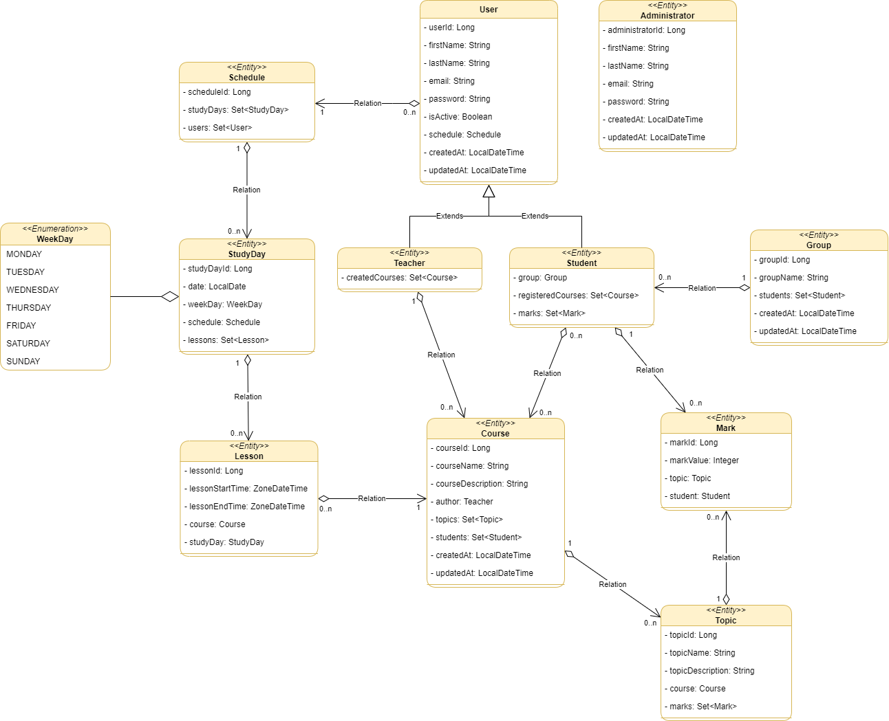

# University CMS

### Class Diagram

Below is a class diagram of our project. It helps to visualize the structure of the project and the relationships between different classes.



**Student** - reflects the student in the learning process; <br>
**Teacher** - corresponds to the teacher in a certain educational institution, has a certain set of courses created by him; <br>
**Course** - corresponds to the training course created by a particular teacher, may have registered students; <br>
**Topic** - corresponds to a specific topic from the course, which has a name and description; <br>
**Mark** - has a certain meaning, topic and belongs to the student; <br>
**Group** - corresponds to a group in an educational institution, consists of a certain number of stuents; <br>
**Administrator** - a person who has advanced management of students, teachers, courses, groups; <br>
**Schedule** - contains a set of study days; <br>
**StudyDay** - corresponds to one study day with the date and day of the week, contains a set of lessons; <br>
**Lesson** - corresponds to one lesson in the study day, contains the start time of the lesson and the end as well as the course; <br>
**WeekDay** - contains seven days of the week, Monday to Sunday.


### Business Requirements

**1. Roles & Login**

- The participant of the educational process should be able to log in as a *teacher* or *student*.

- Also, the *administrator* must be able to log in.

**2. User logged in as Teacher**

- User can see and navigate to `My Schedule` menu.

- User should see own Teacher schedule according with selected date/range filter.

- The user should be able to create/update/delete courses and view their courses.

- The user as a teacher can add and remove students (or entire groups of students) from their courses.

- The user should be able to evaluate the student on a specific topic from his course.

**3. User logged in as Student**

- User can see and navigate to `My Schedule` menu.

- User should see own Student schedule according with selected date/range filter.

- The user can view the courses on which he is registered.

- The user can view his marks on a specific course.

- The user as a student can view other students who belong to the same course or group (each student must necessarily belong to a certain group).

**4. Administrator capabilities**

- The administrator must be able to create/update/delete teachers, students, groups and courses.

- The administrator distributes and adds students to the groups.

# Task 3.2 Bootstrap project

**Assignment** <br>
1. Create new Spring Boot project using [Initializer](https://start.spring.io/) with dependencies:
- **Spring Web** (Build web, including RESTful, applications using Spring MVC. Uses Apache Tomcat as the default embedded container.)
- **Spring Data JPA** (Persist data in SQL stores with Java Persistence API using Spring Data and Hibernate.)
- **Thymeleaf** (A modern server-side Java template engine for both web and standalone environments. Allows HTML to be correctly displayed in browsers and as static prototypes.)
- **Flyway Migration** (Version control for your database so you can migrate from any version (incl. an empty database) to the latest version of the schema.)
- **H2 Database** or **PostgreSQL** Driver of your choice
2. Create model and schema initializing sql migration script according with your UML diagrama
3. Create JPA repositories and service layer with base CRUD operations

**Important** <br>

From now on you should cover all your code (repository, service) with test in case you add any logic like custom query or multiple repository/service calls in one method

Example:

```java
@Repository
public interface GroupRepository extends JpaRepository<Group, Long> {
        
    // should not be covered with test 
    Optional<Group> findByGroupName(String name) throws SQLException;

    // sould be covered with test
    @Query(value = "SELECT gr.* "
			+ "FROM Groups gr inner join (SELECT COUNT(student_id) as studCount, group_id as group_id_counter FROM Students "
			+ "group by group_id " + ") as counter on group_id = group_id_counter "
			+ "WHERE studCount <= :stdCount", nativeQuery = true)
    List<Group> findWithEquelOrLessStudents(@Param("stdCount") int count) throws SQLException;
}


@Service
public class StudentService {

    // should not be covered with tests
    @Transactional
    public void deleteById(Long id) throws SQLException {
		studentRepository.delete(studentOpt.get());
	}
  
    // should be covered with test
    @Transactional
    public Student addCourse(Long studentId, Long courseId) throws SQLException {
	
	    var student = studentRepository.findById(studentId);
	    var course = courseRepository.findById(courseId);

	    if (course.isPresent() && student.isPresent()) {
	        Optional<Course> courseInStudent = student.get().getCourses().stream()
				    .filter(c -> c.getId().equals(courseId)).findFirst();
		    if (courseInStudent.isEmpty()) {
                student.get().getCourses().add(course.get());
                studentRepository.save(student.get());
                return student.get();
            }
        }

        throw new Somexception("Could not add student to course");
	}

}
```

# Task 3.1 Planning: Decompose university

**Important: In the next series of tasks you're going to develop Univesity Schedule web application, make sure to give repo meaningful name (ex. university-cms)**

**Assignment:**

1. Analyze and decompose University (create UML class diagram for application).

You should make a research and describe university structure. The main feature of the application is Class Timetable for students and teachers. Students or teachers can get their timetable for a day or for a month.

2. Add png image to the separate GitLab project.
3. Add text description of main user stories using markup language Example:

```
Teacher can view own schedule flow:

Given user is logged on as Teacher

- User can see and navigate to `My Schedule` menu
- User should see own Teacher schedule according with selected date/range filter
```
