# University CMS

## Motivation & Goal
When creating the app, I was motivated and encouraged by the following aspects:
- The first is the desire to learn new technologies that are used to develop web applications in Java, more precisely it is: `Spring MVC`, `Spring Security`, `Thymeleaf`, `HTML`, `CSS`.
- It should also be said that the development of this application is included in the Foxminded training program. Therefore, the second aspect of motivation was the desire to pass successfully another stage of training.
- The last aspect was the thirst to learn more about the full cycle of software development.

**Technologies used:**
- *Java 17*;
- *Spring (Boot, MVC, Data, Security)*;
- *Hibernate*;
- *PostgreSQL*, *Flyway*;
- *JUnit 5*, *Mockito*, *Testcontainers*;
- *Maven*, *Git*;
- *Docker Compose*, *GitLab CI/CD*;
- *HTML*, *CSS*, *Thymeleaf*, *JavaScript*.

## Description

- **What is University CMS?** <br>
The university CMS is a web platform designed to streamline and automate the educational process, fostering more productive interaction between teachers and students.
- **What problems does the platform solve?** <br>
Effective time management, planning, and meeting deadlines are crucial factors in successful learning. University CMS offers a comprehensive solution to this challenge by providing a platform that not only allows for posting educational materials but also enables the creation of personalized schedules and lesson planning. Students and teachers can easily allocate time across different courses, promoting better organization of the learning process and the development of time management skills.
- **How to use it?** <br>
University CMS facilitates interaction between four types of users: Administrator, Manager, Teacher, and Student. Each user type has unique roles and responsibilities, promoting a clear division of functions and adherence to the Single Responsibility Principle.

  - *Administrator*: <br>
   Manages managers: adds, edits, and deletes their accounts. <br>
   Does not have access to manage teachers or students.

  - *Manager*: <br>
   Manages teachers, students, and groups: creates, edits, and deletes their accounts. <br>
   Adds and removes students from groups.

  - *Teacher*: <br>
   Creates, edits, and manages their own courses. <br>
   Adds students to their courses. <br>
   Manages their own schedule based on the courses they have created. <br>
   Evaluates students on topics within the courses they are enrolled in.

  - *Student*: <br>
   Accesses materials for the courses they are enrolled in. <br>
   Tracks their progress based on teacher evaluations. <br>
   Manages their own schedule and plans lessons for the courses they are enrolled in.

## Install & Run
To **install** this project, you must have Git version control installed on your device. It would also be nice to have a basic knowledge of using Git. You can download and learn how to use the version control system [here](https://git-scm.com/book/en/v2). Go to the folder where you want to install the project. Open Git Bash in it and enter the command:

```
$ git clone https://gitlab.com/SerhiiBohdan/university-cms.git
```

This way you will have the app installed.

There are several ways to **run** the application **locally**. Consider them.
1) Docker Container<br>
   To use this method you must have [`Docker`](https://www.docker.com/products/docker-desktop/) installed on your machine ([more information](https://docs.docker.com/get-started/overview/#docker-objects)). Run it and make sure the docker daemon is running. Next, you should go to the root of the project you just downloaded. To run an application in a docker container, you should run the following command:

   ```
   > docker compose up -d
   ```
   After all containers are successfully launched, go to your browser and enter the following URL: `http://localhost:8083/ui/v1/home`. As a result, you should see the welcome page of the application.


2) Build jar<br>
   This path requires more settings and services. You must have installed:
   - [x] Java 17 (JDK)
   - [x] PostgreSQL or Docker

   1. If you have PostgreSQL installed:<br>
      You should make the following settings:<br>
        a) Create a database, name it `university`.<br>
        b) Next, you should change some settings in the [application.yml](src/main/resources/application.yml) file:<br>
        - replace `jdbc:postgresql://db:5432/university` with `jdbc:postgresql://localhost:5432/university`;<br>
        - change the username `postgres` to the name of the database owner `university` (usually the database owner is `postgres`);<br>
        - finally replace `pass` with the database user password you use to connect to your local database.

        At the end of these settings, you should get the following [application.yml](src/main/resources/application.yml) content:
        ```yml
        spring:
          datasource:
            driver-class-name: org.postgresql.Driver
            url: jdbc:postgresql://localhost:5432/school
            username: your-database-owner-name
            password: your-local-database-password
        ```
    2. If you have Docker installed:<br>
       a) Run Docker on your device and make sure docker daemon is running.<br>
       b) Perform the following command:
       ```
       > docker run -it --rm --detach \
            --name db \
            -e POSTGRES_USER=postgres \
            -e POSTGRES_PASSWORD=pass \
            -e POSTGRES_DB=university \
            -p 5433:5432 \
            postgres:15.3
       ```
        c) Next, replace `jdbc:postgresql://db:5432/university` with `jdbc:postgresql://localhost:5433/university` in the [application.yml](src/main/resources/application.yml) file.

    Now you have a database in which the necessary data will be stored. And modifying the [application.yml](src/main/resources/application.yml) file will ensure that the application can successfully connect to this database at runtime. Now you can run the application by executing the following commands in the root of the project:<br>

    - for Windows (cmd)
    ```
    > mvnw.cmd package -DskipTests
    ```
    - for Linux/MacOS
    ```
    > ./mvnw package -DskipTests
    ```
    and further
    ```
    > java -jar target/university-cms-0.0.1-SNAPSHOT.jar
    ```

   Next, go to your browser and enter the following URL: `http://localhost:8083/ui/v1/home`. As a result, you should see the welcome page of the application.

## Perform authorization
In order to log in, you need to click the "Login" button in the upper right corner of the welcome page. Below are the data for authorizing users with different roles. Use them to continue working.
- admin: `username - anthony.taylor@gmail.com`, `password - admin1234`;
- manager: `username - alex.brown@gmail.com`, `password - 7aB#3mW8!yT4`;
- teacher: `username - john.doe@gmail.com`, `password - et!@-Lj^rd123`;
- student: `username - taylor.smith789@gmail.com`, `password - D1@F3^G%y&`.

## Tests
The application has a set of unit tests that you can also run and verify that they pass successfully. What you need to have to run the tests:
- [x] Java 17 (JDK)
- [x] Docker

*Why do you need Docker to run tests?* The reason is that the tests for some classes use a database that is deploying in a docker container, that is, we are dealing with Testcontainers. Therefore, before running the tests, make sure that the docker daemon is running on your device. Next, execute the following command in the root of the project:<br>

* for Windows (cmd)
```
> mvnw.cmd test
```
* for Linux/MacOS
```
> ./mvnw test
```
She will do the tests.

### Class Diagram

Below is a class diagram of our project. It helps to visualize the structure of the project and the relationships between different classes.



**Admin** - a user who manages managers in the system. <br>
**Manager** - a user who has advanced management of students, teachers, groups; <br>
**Student** - reflects the student in the learning process; <br>
**Teacher** - corresponds to the teacher in a certain educational institution, has a certain set of courses created by him; <br>
**Course** - corresponds to the training course created by a particular teacher, may have registered students; <br>
**Topic** - corresponds to a specific topic from the course, which has a name and description; <br>
**Mark** - has a certain meaning, topic and belongs to the student; <br>
**Group** - corresponds to a group in an educational institution, consists of a certain number of students; <br>
**Schedule** - contains a set of study days; <br>
**StudyDay** - corresponds to one study day with the date and day of the week, contains a set of lessons; <br>
**Lesson** - corresponds to one lesson in the study day, contains the start time of the lesson and the end as well as the course; <br>

### Business Requirements

**1. Roles & Login**

- The participant of the educational process should be able to log in as a *teacher* or *student*.

- Also, the *administrator* must be able to log in.

**2. User logged in as Teacher**

- User can see and navigate to `My Schedule` menu.

- User should see own Teacher schedule according with selected date/range filter.

- The user should be able to create/update/delete courses and view their courses.

- The user as a teacher can add and remove students (or entire groups of students) from their courses.

- The user should be able to evaluate the student on a specific topic from his course.

**3. User logged in as Student**

- User can see and navigate to `My Schedule` menu.

- User should see own Student schedule according with selected date/range filter.

- The user can view the courses on which he is registered.

- The user can view his marks on a specific course.

- The user as a student can view other students who belong to the same course or group (each student must necessarily belong to a certain group).

**4. Manager capabilities**

- The manager must be able to create/update/delete teachers, students, groups and courses.

- The manager distributes and adds students to the groups.

# Task 3.8 Implement Teachers view + edit features

**Assignment**

Using your flows descriptions from task 3.1 create list of flows to implement, call it features, consult with Mentor if required.

Example:

```
Given User `B` logged in with Teacher role.
- User 'B' should be able to list all its courses.

... etc
```

Consider feature implementation as subtask(made in new branch and merged into main/master on completion)

For each feature, implement UI pages(usually list, create, edit, delete, etc.), controller/controller methods, service/service methods, repository methods.

Controller tests are mandatory, add other components tests if required.

# Task 3.7 Implement Students view + edit feature

**Assignment**

Using your flows descriptions from task 3.1 create list of flows to implement, call it features, consult with Mentor if required.

Example:

```
Given User A logged in with Admin, or Stuff role.
- User 'A' can assign/ reassign Students to Group

Given User B logged in with Admin, Stuff, Student, or Teacher role.
- User 'B' should be able to list all students in a group (read access).
... etc
```

Consider feature implementation as subtask(made in new branch and merged into main/master on completion)

For each feature, implement UI pages(usually list, create, edit, delete, etc.), controller/controller methods, service/service methods, repository methods.

Controller tests are mandatory, add other components tests if required.

# Task 3.6 Implement Groups view + edit feature

**Assignment**

Using your flows descriptions from task 3.1 create list of flows to implement, call it features, consult with Mentor if required.

Example:

```
User administration flow

Given User A logged in with Admin role
- User 'A' can Create/Read/Update/Delete group information
Given User B logged in with Student or Teacher role.
- User 'A' should be able to list all groups information (read access).
Given User C logged in with Stuff role
- User 'A' should be able to Create/Read/Update group information.
... etc
```

Consider feature implementation as subtask(made in new branch and merged int main/master on completion)

For each feature, implement UI pages(usually list, create, edit, delete, etc), controller/controller methods, service/service methods, repository methods.

Controller tests are mandatory, add other components tests if required.

# Task 3.5 Implement Course view + edit feature

**Assignment**
1) Using your flows descriptions from task 3.1 create a list of flows to implement, call it features, consult with Mentor if required. <br>
   Example:

   <pre style="font-family: monospace">
   User administration flow
   Given User A logged in with Admin role
   - User 'A' should be able to create/read/update/delete courses.

   Given User B logged in with Student or Teacher role
   - User 'B' should be able to list all courses (read access).

   Given User C logged in with Stuff rolef
   - User 'C' should be able to create/read/update all courses
   - User 'C' should be able to assign/reassign teacher to a course
   - User 'C' should be able to assign/reassign groups to a course.
   ... etc
   </pre>

2) Consider feature implementation as subtask (made in new branch and merged into main/master on completion) <br>
   For each feature, implement UI pages(usually list, create, edit, delete, etc), controller/controller methods, service/service methods, repository methods. <br>
   Controller tests are mandatory, add other components tests if required.

# Task 3.4 Adding Security

**Assignment**
1. Review your user/roles model, and ask your mentor for clarifications regarding your security model. For example, you can add ADMIN, STUDENT, TEACHER, and STUFF roles.
2. Use form security for user authentication.
3. Create an admin panel for assigning a new user's role and create services that help the admin manage users.
4. Add required changes with login/logout functionality and logged-in user information to UI

Read: <br>
[https://www.baeldung.com/spring-security-login](https://www.baeldung.com/spring-security-login) <br>
[https://www.baeldung.com/spring-security-method-security](https://www.baeldung.com/spring-security-method-security )<br>
[https://www.thymeleaf.org/doc/articles/springsecurity.html](https://www.thymeleaf.org/doc/articles/springsecurity.html) <br>
[https://docs.spring.io/spring-security/site/docs/4.2.x/reference/html/test-method.html](https://docs.spring.io/spring-security/site/docs/4.2.x/reference/html/test-method.html)

Security configuration example:

```java
@Bean
SecurityFilterChain config(HttpSecurity httpSecurity) throws Exception {
    return httpSecurity.authorizeHttpRequests() .requestMatchers("/css/**", "/webjars/**").permitAll() // public matcher first
            .requestMatchers("/foo").hasRole("FOO") // single role
            .requestMatchers("/bar", "/foo-bar").hasAnyRole("FOO", "FOO_BAR") // multiple roles
            .anyRequest().authenticated() // other requests need to have any role
            .and().formLogin() .and().build();
 }
```
Example:

<pre style="font-family: monospace">
User administration flow

Given User `A` logged in with Admin role
- User 'A' should be able to navigate to admin panel
- User without admin role should not have access to user admin panel
- User 'A' should be able to list all registered users on user admin page
- User 'A' should be able to set required role for each registered user
... etc
</pre>

# Task 3.3 Create basic UI

**Assignment:** <br>
1. [Add Bootstrap](https://www.baeldung.com/spring-boot-start) js/css support to your project (webjars recommended)
2. Add basic data generation or migration script to populate your db with sample data
3. Create welcome page and controller with menu with main entities from your model

**Important** use thymeleaf templates and reusable fragments

4. Create pages with tables to list content from DB for each Entity and link those pages from main menu
5. Cover controllers with [Spring MVC tests](https://www.baeldung.com/spring-boot-testing#unit-testing-with-webmvctest)

# Task 3.2 Bootstrap project

**Assignment** <br>
1. Create new Spring Boot project using [Initializer](https://start.spring.io/) with dependencies:
- **Spring Web** (Build web, including RESTful, applications using Spring MVC. Uses Apache Tomcat as the default embedded container.)
- **Spring Data JPA** (Persist data in SQL stores with Java Persistence API using Spring Data and Hibernate.)
- **Thymeleaf** (A modern server-side Java template engine for both web and standalone environments. Allows HTML to be correctly displayed in browsers and as static prototypes.)
- **Flyway Migration** (Version control for your database so you can migrate from any version (incl. an empty database) to the latest version of the schema.)
- **H2 Database** or **PostgreSQL** Driver of your choice
2. Create model and schema initializing sql migration script according with your UML diagrama
3. Create JPA repositories and service layer with base CRUD operations

**Important** <br>

From now on you should cover all your code (repository, service) with test in case you add any logic like custom query or multiple repository/service calls in one method

Example:

```java
@Repository
public interface GroupRepository extends JpaRepository<Group, Long> {

    // should not be covered with test
    Optional<Group> findByGroupName(String name) throws SQLException;

    // sould be covered with test
    @Query(value = "SELECT gr.* "
			+ "FROM Groups gr inner join (SELECT COUNT(student_id) as studCount, group_id as group_id_counter FROM Students "
			+ "group by group_id " + ") as counter on group_id = group_id_counter "
			+ "WHERE studCount <= :stdCount", nativeQuery = true)
    List<Group> findWithEquelOrLessStudents(@Param("stdCount") int count) throws SQLException;
}


@Service
public class StudentService {

    // should not be covered with tests
    @Transactional
    public void deleteById(Long id) throws SQLException {
		studentRepository.delete(studentOpt.get());
	}

    // should be covered with test
    @Transactional
    public Student addCourse(Long studentId, Long courseId) throws SQLException {

	    var student = studentRepository.findById(studentId);
	    var course = courseRepository.findById(courseId);

	    if (course.isPresent() && student.isPresent()) {
	        Optional<Course> courseInStudent = student.get().getCourses().stream()
				    .filter(c -> c.getId().equals(courseId)).findFirst();
		    if (courseInStudent.isEmpty()) {
                student.get().getCourses().add(course.get());
                studentRepository.save(student.get());
                return student.get();
            }
        }

        throw new Somexception("Could not add student to course");
	}

}
```

# Task 3.1 Planning: Decompose university

**Important: In the next series of tasks you're going to develop Univesity Schedule web application, make sure to give repo meaningful name (ex. university-cms)**

**Assignment:**

1. Analyze and decompose University (create UML class diagram for application).

You should make a research and describe university structure. The main feature of the application is Class Timetable for students and teachers. Students or teachers can get their timetable for a day or for a month.

2. Add png image to the separate GitLab project.
3. Add text description of main user stories using markup language Example:

```
Teacher can view own schedule flow:

Given user is logged on as Teacher

- User can see and navigate to `My Schedule` menu
- User should see own Teacher schedule according with selected date/range filter
```
